# Laporan Resmi Praktikum Jarkom Modul 2 2023

Repository in ***Bahasa***

**Topic :**

Domain Name System (DNS) & Web Server

**Identity :** 

Kelompok F07 -
Jaringan Komputer (F) </br>
*Insitut Teknologi Sepuluh Nopember*

**Author's :**
| Name                              | Student ID |
| ----------------------------------|------------|
| Arfi Raushani Fikra               | 5025211084 |
| Rafi Aliefian Putra Ramadhani     | 5025211234 |

## List of Content's
- [Preparation](#preparation)
  - [Topology](#topology)
  - [Node Config](#node-config)
  - [Install & Setup](#install--setup)
- [Question 1 - *DNS*](#question-1---dns)
  - [Script Solution](#script-solution)
  - [Test Result](#test-result)
- [Question 2 - *DNS*](#question-2---dns)
  - [Script Solution](#script-solution-1)
  - [Test Result](#test-result-1)
- [Question 3 - *DNS*](#question-3---dns)
  - [Script Solution](#script-solution-2)
  - [Test Result](#test-result-2)
- [Question 4 - *DNS*](#question-4---dns)
  - [Script Solution](#script-solution-3)
  - [Test Result](#test-result-3)
- [Question 5 - *DNS*](#question-5---dns)
  - [Script Solution](#script-solution-4)
  - [Test Result](#test-result-4)
- [Question 6 - *DNS*](#question-6---dns)
  - [Script Solution](#script-solution-5)
  - [Test Result](#test-result-5)
- [Question 7 - *DNS*](#question-7---dns)
  - [Script Solution](#script-solution-6)
  - [Test Result](#test-result-6)
- [Question 8 - *DNS*](#question-8---dns)
  - [Script Solution](#script-solution-7)
  - [Test Result](#test-result-7)
- [Question 9 - *Web Server*](#question-9---web-server)
  - [Script Solution](#script-solution-8)
  - [Test result](#test-result-8)
- [Question 10 - *Web Server*](#question-10---web-server)
  - [Script Solution](#script-solution-9)
  - [Test Result](#test-result-9)
- [Question 11 - *Web Server*](#question-11---web-server)
  - [Script Solution](#script-solution-10)
  - [Test Result](#test-result-10)
- [Question 12 - *Web Server*](#question-12---web-server)
  - [Script Solution](#script-solution-11)
  - [Test Result](#test-result-11)
- [Question 13 - *Web Server*](#question-13---web-server)
  - [Script Solution](#script-solution-12)
  - [Test Result](#test-result-12)
- [Question 14 - *Web Server*](#question-14---web-server)
  - [Script Solution](#script-solution-13)
  - [Test Result](#test-result-13)
- [Question 15 - *Web Server*](#question-15---web-server)
  - [Script Solution](#script-solution-14)
  - [Test Result](#test-result-14)
- [Question 16 - *Web Server*](#question-16---web-server)
  - [Script Solution](#script-solution-15)
  - [Test Result](#test-result-15)
- [Question 17 - *Web Server*](#question-17---web-server)
  - [Script Solution](#script-solution-16)
  - [Test Result](#test-result-16)
- [Question 18 - *Web Server*](#question-18---web-server)
  - [Script Solution](#script-solution-17)
  - [Test Result](#test-result-17)
- [Question 19 - *Web Server*](#question-19---web-server)
  - [Script Solution](#script-solution-18)
  - [Test Result](#test-result-18)
- [Question 20 - *Web Server*](#question-20---web-server)
  - [Script Solution](#script-solution-19)
  - [Test Result](#test-result-19)

# Preparation
> Must be known before starting configuration
## Topology
> *Using Topology number 7*

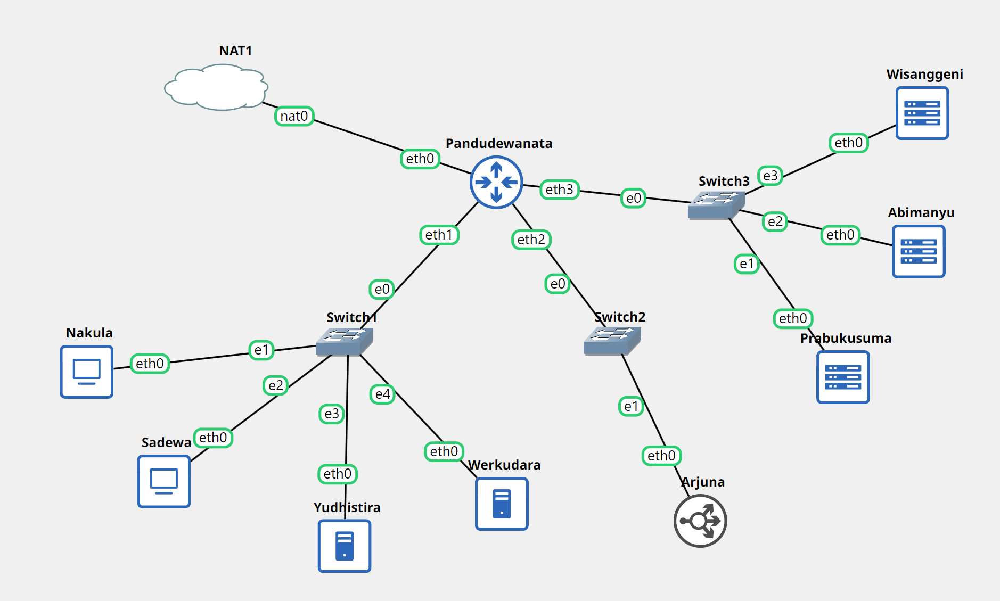

## Node Config
- **Router** 
  - Pandudewanata
  ```
  auto eth0
  iface eth0 inet dhcp

  auto eth1
  iface eth1 inet static
      address 10.55.1.1
      netmask 255.255.255.0

  auto eth2
  iface eth2 inet static
      address 10.55.2.1
      netmask 255.255.255.0

  auto eth3
  iface eth3 inet static
      address 10.55.3.1
      netmask 255.255.255.0

  ```

**Switch 1**
- **Client**
  - Nakula
  ```
  auto eth0
  iface eth0 inet static
        address 10.55.1.2
	    netmask 255.255.255.0
	    gateway 10.55.1.1
  ```
  - Sadewa
  ```
  auto eth0
  iface eth0 inet static
	    address 10.55.1.3
        netmask 255.255.255.0
        gateway 10.55.1.1
  ```
- DNS
  - Yudhistira (Master)
  ```
  auto eth0
  iface eth0 inet static
        address 10.55.1.4
        netmask 255.255.255.0
        gateway 10.55.1.1
  ```
  - Werkudara (Slave)
  ```
  auto eth0
  iface eth0 inet static
        address 10.55.1.5
        netmask 255.255.255.0
        gateway 10.55.1.1
  ```

**Switch 2**
- **Load Balancer**
  - Arjuna
  ```
  auto eth0
  iface eth0 inet static
        address 10.55.2.2
        netmask 255.255.255.0
        gateway 10.55.2.1
  ```

**Switch 3**
- **Web Server**
  - Prabukusuma
  ```
  auto eth0
  iface eth0 inet static
        address 10.55.3.2
        netmask 255.255.255.0
        gateway 10.55.3.1
  ```
  - Abimanyu
  ```
  auto eth0
  iface eth0 inet static
        address 10.55.3.3
        netmask 255.255.255.0
        gateway 10.55.3.1
  ```
  - Wisanggeni
  ```
  auto eth0
  iface eth0 inet static
        address 10.55.3.4
        netmask 255.255.255.0
        gateway 10.55.3.1
  ```

## Install & Setup
- **Router (Pandudewanata)**
```
iptables -t nat -A POSTROUTING -o eth0 -j MASQUERADE -s 10.55.0.0/16
echo 'nameserver 192.168.122.1' > /etc/resolv.conf
```
- **DNS Master & Slave (Yudhistira & Werkudara)**
```
echo 'nameserver 192.168.122.1' > /etc/resolv.conf
apt-get update
apt-get install bind9 -y      
```
- **Client (Nakula & Sadewa)**
```
echo '
nameserver 10.55.1.4 # IP Yudhistira
nameserver 10.55.1.5 # IP Werkudara
nameserver 192.168.122.1' > /etc/resolv.conf

apt-get update
apt-get install dnsutils -y
apt-get install lynx -y
```
- **Web Server Nginx**
 ```
apt install nginx php php-fpm -y
```
- **Web Server Apache2**
```
apt-get update
apt-get install dnsutils -y
apt-get install lynx -y
apt-get install nginx -y
service nginx start
apt-get install apache2 -y
apt-get install libapache2-mod-php7.0 -y
service apache2 start
apt-get install wget -y
apt-get install unzip -y
apt-get install php -y
echo -e "\n\nPHP Version:"
php -v
```
- **Zip Download & Unzip Web Server Resources**
```
wget -O '/var/www/abimanyu.f07.com' 'https://drive.usercontent.google.com/download?id=1a4V23hwK9S7hQEDEcv9FL14UkkrHc-Zc'
unzip -o /var/www/abimanyu.f07.com -d /var/www/
mv /var/www/abimanyu.yyy.com /var/www/abimanyu.f07
rm /var/www/abimanyu.f07.com
rm -rf /var/www/abimanyu.yyy.com

wget -O '/var/www/parikesit.abimanyu.f07.com' 'https://drive.usercontent.google.com/download?id=1LdbYntiYVF_NVNgJis1GLCLPEGyIOreS'
unzip -o /var/www/parikesit.abimanyu.f07.com -d /var/www/
mv /var/www/parikesit.abimanyu.yyy.com /var/www/parikesit.abimanyu.f07
rm /var/www/parikesit.abimanyu.f07.com
rm -rf /var/www/parikesit.abimanyu.yyy.com
mkdir /var/www/parikesit.abimanyu.f07/secret

wget -O '/var/www/rjp.baratayuda.abimanyu.f07.com' 'https://drive.usercontent.google.com/download?id=1pPSP7yIR05JhSFG67RVzgkb-VcW9vQO6'
unzip -o /var/www/rjp.baratayuda.abimanyu.f07.com -d /var/www/
mv /var/www/rjp.baratayuda.abimanyu.yyy.com /var/www/rjp.baratayuda.abimanyu.f07
rm /var/www/rjp.baratayuda.abimanyu.f07.com
rm -rf /var/www/rjp.baratayuda.abimanyu.yyy.com
```

--- 
## Question 1 - *DNS*
> Yudhistira akan digunakan sebagai DNS Master, Werkudara sebagai DNS Slave, Arjuna merupakan Load Balancer yang terdiri dari beberapa Web Server yaitu Prabakusuma, Abimanyu, dan Wisanggeni. Buatlah topologi nya!

Setelah membuat Topologi *Node* dan konfigurasi Node, langkah selanjutnya yaitu melakukan setup pada *Node router* (Pandudewanata) dan juga pada *Node client* (Nakula & Sadewa).

### Script Solution
> Testing Node
```
ping google.com -c 3
```

### Test Result
***Nakula*** :
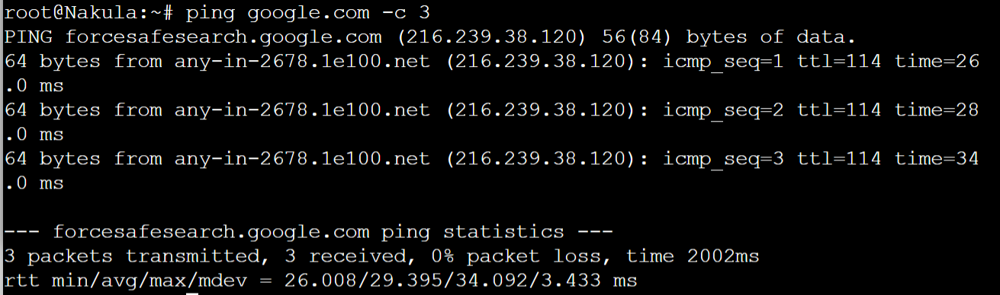

***Sadewa*** :
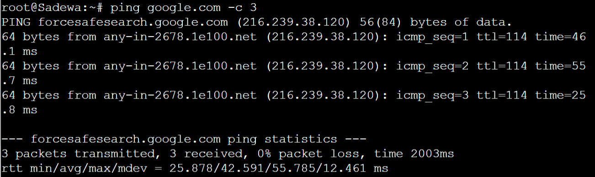


## Question 2 - *DNS*
> Buatlah website utama pada node arjuna dengan akses ke **arjuna.yyy.com** dengan alias **www.arjuna.yyy.com** dengan yyy merupakan kode kelompok!

Dilakukan setup terlebih dahulu pada *Node* Yudhistira (DNS Master). Setelah itu dilanjut dengan pembuatan domain yang tertera pada script berikut.

### Script Solution
- Node Yudhistira
```
echo 'zone "arjuna.f07.com" {
        type master;
        file "/etc/bind/praktikum-jarkom/arjuna.f07.com";
};'

mkdir /etc/bind/praktikum-jarkom

echo "
\$TTL    604800
@       IN      SOA     arjuna.f07.com. root.arjuna.f07.com. (
                        2023101101      ; Serial
                        604800          ; Refresh
                        86400           ; Retry
                        2419200         ; Expire
                        604800 )        ; Negative Cache TTL
;
@               IN      NS      arjuna.f07.com.
@               IN      A       10.55.2.2 ; IP Arjuna
www             IN      CNAME   arjuna.f07.com.
" > /etc/bind/praktikum-jarkom/arjuna.f07.com

service bind9 restart
```
Setelah itu melakukan *setup* yaitu menghapus *namserver 192.168.122.1* atau *nameserver router* dan menambahkan *nameserver IP Node Yudhistira* dalam file **/etc/resolv.conf** pada *Node Client* (Nakula / Sadewa) seperti berikut :
```
nameserver 10.55.1.4
```
Dan setelah itu dapat dibuktikan dengan melakukan **Ping** dan **CNAME** pada domain yang telah dibuat 
```
ping arjuna.f07.com -c 3
ping www.arjuna.f07.com -c 3
host -t CNAME www.arjuna.f07.com
```

### Test Result
Test tanpa **www**
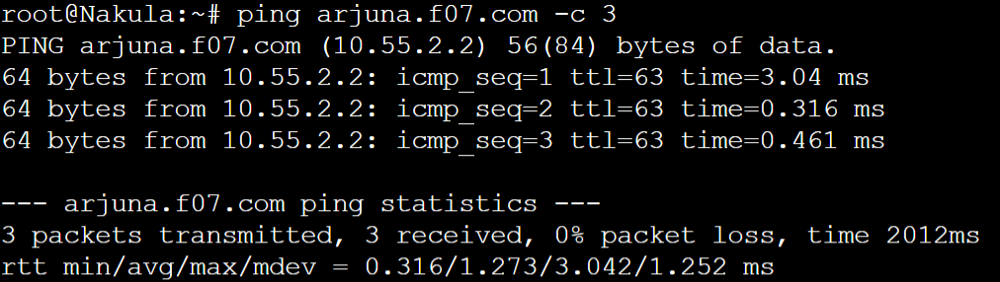

Test menggunakan **www**
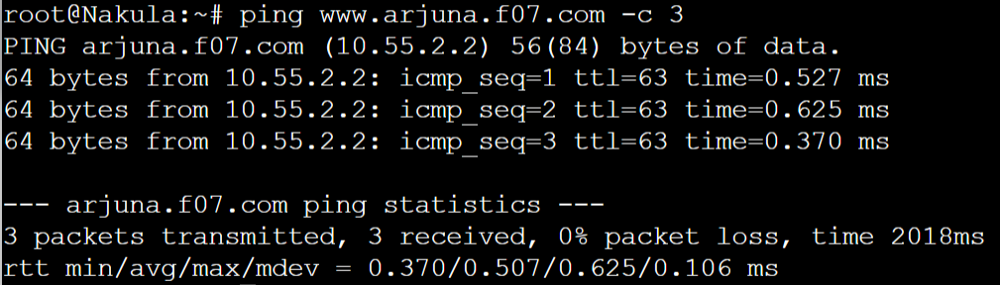

Test Alias dari **www**
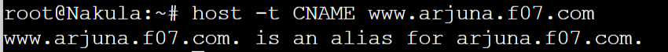


## Question 3 - *DNS*
> Dengan cara yang sama seperti soal nomor 2, buatlah website utama dengan akses ke **abimanyu.yyy.com** dan alias **www.abimanyu.yyy.com**!

Langkah-langkah implementasi yang dilakukan sama seperti *Question 2*, perbedaan nya hanya terletak pada nama *domain*

### Script Solution
- Node Yudhistira
```
echo 'zone "abimanyu.f07.com" {
        type master;
        file "/etc/bind/praktikum-jarkom/abimanyu.f07.com";
};'

echo "
\$TTL    604800
@       IN      SOA     abimanyu.f07.com. root.abimanyu.f07.com. (
                        2023101101      ; Serial
                        604800          ; Refresh
                        86400           ; Retry
                        2419200         ; Expire
                        604800 )        ; Negative Cache TTL
;
@               IN      NS      abimanyu.f07.com.
@               IN      A       10.55.3.3 ; IP Abimanyu
www             IN      CNAME   abimanyu.f07.com.
" > /etc/bind/praktikum-jarkom/abimanyu.f07.com

service bind9 restart
```

Setelah itu, dikarenakan *nameserver* masih menggunakan *IP Node Yudhistira* maka langkah selanjutnya yaitu langsung dibuktikan dengan melakukan **Ping** dan **CNAME** pada domain
```
ping abimanyu.f07.com -c 3
ping www.abimanyu.f07.com -c 3
host -t CNAME www.abimanyu.f07.com
```

### Test Result
Test tanpa **www**
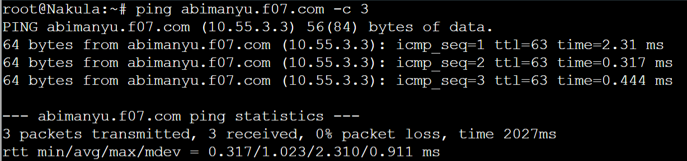

Test menggunakan **www**
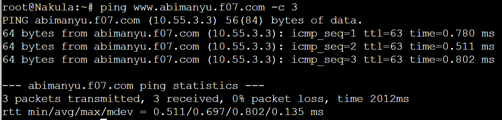

Test Alias dari **www**
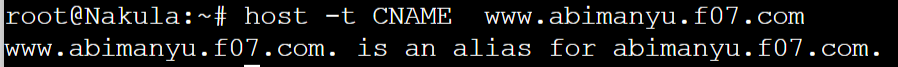


## Question 4 - *DNS*
> Kemudian, karena terdapat beberapa web yang harus di-deploy, buatlah subdomain **parikesit.abimanyu.yyy.com** yang diatur DNS-nya di Yudhistira dan mengarah ke Abimanyu!

Dalam membuat *subdomain* pada domain *abimanyu.yyy.com*, perlu menambahkan baris baru dengan nama **parikesit** pada file *abimanyu.f07.com* dengan type **A** 

### Script Solution
- Node Yudhistira
```
echo "
\$TTL    604800
@       IN      SOA     abimanyu.f07.com. root.abimanyu.f07.com. (
                        2023101101      ; Serial
                        604800          ; Refresh
                        86400           ; Retry
                        2419200         ; Expire
                        604800 )        ; Negative Cache TTL
;
@               IN      NS      abimanyu.f07.com.
@               IN      A       10.55.3.3 ; IP Abimanyu
www             IN      CNAME   abimanyu.f07.com.
parikesit       IN      A       10.55.3.3 ; IP Abimanyu
" > /etc/bind/praktikum-jarkom/abimanyu.f07.com

service bind9 restart
```
Setelah itu, langkah selanjutnya masih sama dengan *Question 2 / 3*, yaitu langsung dibuktikan melalui **Ping**
```
ping parikesit.abimanyu.f07.com -c 3
```

### Test Result
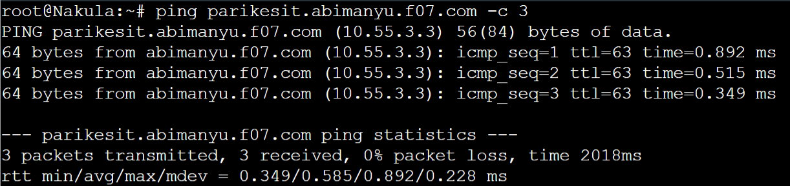


## Question 5 - *DNS*
> Buat juga reverse domain untuk domain utama. (Abimanyu saja yang direverse)!

Sebelum melakukan reverse domain, langkah pertama adalah perlu untuk mengetahui IP dari *Node* Abimanyu. Karena IP Abimanyu adalah 10.55.3.3, maka kita perlu mengubahnya menjadi 3.3.55.10. 

### Script Solution
Setelah mengetahui IP dari *Node* Abimanyu, kita perlu mengedit file **/etc/bind/named.conf.local** dengan menambahkan 3 byte awal dari IP *Node* Abimanyu seperti berikut
- Node Yudhistira
```
echo 'zone "3.55.10.in-addr.arpa" { 
        type master;
        file "/etc/bind/praktikum-jarkom/3.55.10.in-addr.arpa";
};' > /etc/bind/named.conf.local
```
Dan dilanjut dengan meng-copy file **db.local** ke-dalam folder **praktikum-jarkom** dan merubah namanya menjadi **/etc/bind/jarkom/3.55.10.in-addr.arpa**. Setlah itu mengeditnya menjadi seperti berikut 
```
echo "
\$TTL    604800
@       IN      SOA     abimanyu.f07.com. root.abimanyu.f07.com. (
                        2023101101      ; Serial
                        604800          ; Refresh
                        86400           ; Retry
                        2419200         ; Expire
                        604800 )        ; Negative Cache TTL
;
3.55.10.in-addr.arpa.   IN      NS      abimanyu.f07.com.
3                       IN      PTR     abimanyu.f07.com.
" > /etc/bind/praktikum-jarkom/3.55.10.in-addr.arpa

service bind9 restart
```
Untuk mengecek apakah konfigurasi sudah benar atau belum, lakukan perintah berikut 
```
apt-get update
apt-get install dnsutils
```
Pastikan nameserver di **/etc/resolv.conf** pada *Node Yudhistira* telah dikembalikan sama dengan nameserver dari **Pandudewanata** 

Setelah itu, testing dapat dilakukan sama seperti pada *Question 2 / 3 / 4* yaitu pada *Node Client* dengan memasukkan command berikut
```
host -t PTR 10.55.3.3
```

### Test Result
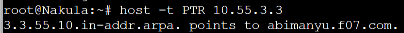


## Question 6 - *DNS*
> Agar dapat tetap dihubungi ketika DNS Server Yudhistira bermasalah, buat juga Werkudara sebagai DNS Slave untuk domain utama.

Dalam membuat DNS Slave, kita memerlukan beberapa konfigurasi pada `DNS Master` dan `DNS Slave (Node Werkudara)`

### Script Solution
Langkah awal adalah menambahkan *nofity, also-notify dan allow-transfer* agar memberikan izin kepada *IP* yang dituju
- Node Yudhistira
```
echo 'zone "arjuna.f07.com" {
        type master;
        notify yes;
        also-notify { 10.55.1.5; }; // IP Werkudara
        allow-transfer { 10.55.1.5; }; // IP Werkudara
        file "/etc/bind/praktikum-jarkom/arjuna.f07.com";
};

zone "abimanyu.f07.com" {
        type master;
        notify yes;
        also-notify { 10.55.1.5; }; // IP Werkudara
        allow-transfer { 10.55.1.5; }; // IP Werkudara
        file "/etc/bind/praktikum-jarkom/abimanyu.f07.com";
};

zone "3.55.10.in-addr.arpa" { 
        type master;
        file "/etc/bind/praktikum-jarkom/3.55.10.in-addr.arpa";
};' > /etc/bind/named.conf.local

service bind9 restart
service bind9 stop // Stop untuk testing Slave
```

- Node Werkudara (Slave)

Membuat **type slave** pada zone dari *domain* dan mengubah *path file*
```
echo 'zone "arjuna.f07.com" {
        type slave;
        masters { 10.55.1.4; }; // IP Yudhistira
        file "/var/lib/bind/arjuna.f07.com";
};

zone "abimanyu.f07.com" {
        type slave;
        masters { 10.55.1.4; }; // IP Yudhistira
        file "/var/lib/bind/abimanyu.f07.com";
};' > /etc/bind/named.conf.local

service bind9 restart
```

Setelah itu, untuk membuktikan *Slave* berhasil atau tidak, perlu ditambahkan `IP Werkudara` pada **/etc/resolv.conf** didalam *Node Client*
```
nameserver 10.55.1.5
```

Jika sudah, testing dapat dilakukan dengan melakukan **Ping** pada domain yang telah dibuat seperti `Arjuna` dan `Abimanyu`
```
ping arjuna.f07.com -c 3
ping abimanyu.f07.com -c 3
```

### Test Result
Start bind9 **Werkudara**
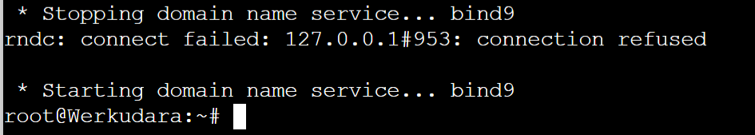

Stop bind9 **Yudhistira**
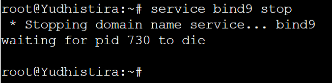

Test domain **Arjuna**
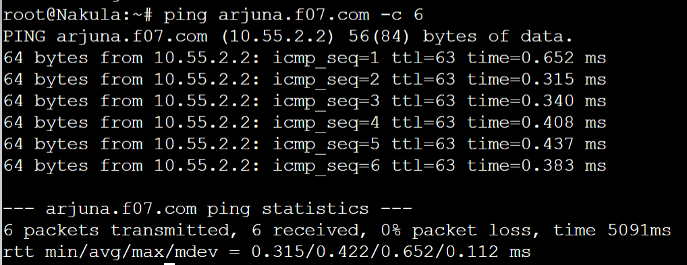

Test domain **Abimanyu**
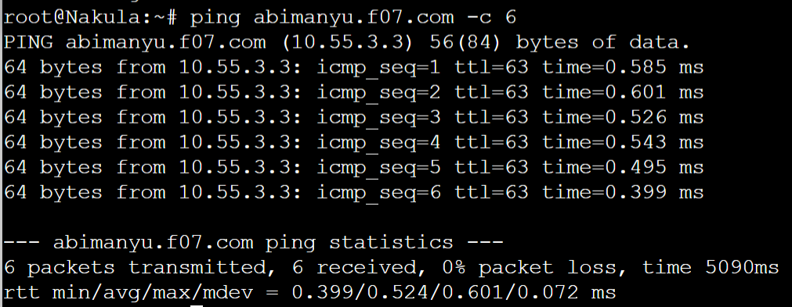


## Question 7 - *DNS*
> Seperti yang kita tahu karena banyak sekali informasi yang harus diterima, buatlah subdomain khusus untuk perang yaitu **baratayuda.abimanyu.yyy.com** dengan alias **www.baratayuda.abimanyu.yyy.com** yang didelegasikan dari Yudhistira ke Werkudara dengan IP menuju ke Abimanyu dalam folder Baratayuda.

Dalam membuat Delegasi subdomain, diperlukan beberapa configurasi pada `DNS Master` dan `DNS Slave`. Kita juga memerlukan bantuan ``allow-query { any; };`` pada `DNS Master dan Slave. Serta kita memerlukan ``NS`` karena NS digunakan untuk delegasi zona DNS untuk menggunakan authoritative name server yang diberikan

### Script Solution
Perlu menambahkan ``ns1     IN      A       10.55.1.5     ; IP Werkudara`` agar mendapatkan authoritative terhadap Werkudara. Kita juga perlu mengaktifkan ``allow-query { any; };`` pada `DNS Master`. Dan juga perlu untuk mengedit **/etc/bind/named.conf.local** 
- Node Yudhistira
```
echo '
$TTL    604800
@       IN      SOA     abimanyu.f07.com. root.abimanyu.f07.com. (
                        2023101101      ; Serial
                        604800          ; Refresh
                        86400           ; Retry
                        2419200         ; Expire
                        604800 )        ; Negative Cache TTL
;
@               IN      NS      abimanyu.f07.com.
@               IN      A       10.55.3.3 ; IP Abimanyu
www             IN      CNAME   abimanyu.f07.com.
parikesit       IN      A       10.55.3.3 ; IP Abimanyu
ns1             IN      A       10.55.1.5 ; IP Werkudara
baratayuda      IN      NS      ns1
' > /etc/bind/praktikum-jarkom/abimanyu.f07.com

echo '
options {
        directory "var/cache/bind";
        //dnssec-validation auto;
        allow-query{any;};
        auth-nxdomain no;    # conform to RFC1035
        listen-on-v6 { any; };
};
' > /etc/bind/named.conf.options

echo 'zone "abimanyu.f07.com" {
        type master;
        file "/etc/bind/praktikum-jarkom/abimanyu.f07.com";
        allow-transfer { 10.55.1.5; }; // IP Werkudara
};

zone "3.55.10.in-addr.arpa" { 
        type master;
        file "/etc/bind/praktikum-jarkom/3.55.10.in-addr.arpa";
};' > /etc/bind/named.conf.local

service bind9 restart 
```

- Node Werkudara

Dan juga perlu setup juga pada *Node Werkudara* untuk mengarahkan `zone` ke `DNS Master` agar authoritative tadi dapat jalan. Kita juga perlu mengaktifkan ``allow-query { any; };`` pada `DNS Slave`
```
echo '
options {
        directory "var/cache/bind";
        //dnssec-validation auto;
        allow-query{any;};
        auth-nxdomain no;    # conform to RFC1035
        listen-on-v6 { any; };
};
' > /etc/bind/named.conf.options

echo 'zone "baratayuda.abimanyu.f07.com"{
        type master;
        file "/etc/bind/Baratayuda/baratayuda.abimanyu.f07.com";
};'> /etc/bind/named.conf.local

mkdir -p /etc/bind/Baratayuda
cp /etc/bind/db.local /etc/bind/Baratayuda/baratayuda.abimanyu.f07.com

echo '
$TTL    604800
@       IN      SOA     baratayuda.abimanyu.f07.com. root.baratayuda.abimanyu.f07.com. (
                        2023101101      ; Serial
                        604800          ; Refresh
                        86400           ; Retry
                        2419200         ; Expire
                        604800 )        ; Negative Cache TTL
;
@               IN      NS      baratayuda.abimanyu.f07.com.
@               IN      A       10.55.3.3       ; IP Abimanyu
www             IN      CNAME   baratayuda.abimanyu.f07.com.
' > /etc/bind/Baratayuda/baratayuda.abimanyu.f07.com

service bind9 restart
```

Setelah semua berhasil di-setup, untuk melakukan testing cukup melakukan **Ping** pada `baratayuda.abimanyu.f07.com` atau `www.baratayuda.abimanyu.f07.com` dan juga Alias dapat dilihat dengan menjalankan **CNAME**
```
ping baratayuda.abimanyu.f07.com -c 3
ping www.baratayuda.abimanyu.f07.com -c 3
host -t CNAME www.baratayuda.abimanyu.f07.com 
```

### Test Result
Test tanpa **www**
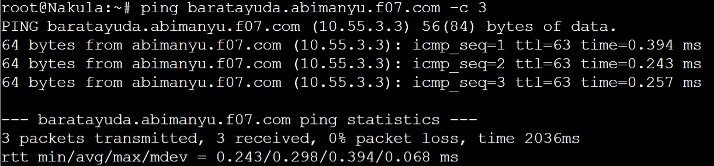

Test menggunakan **www**
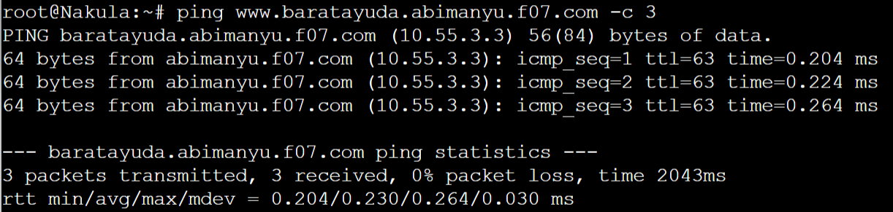

Test Alias dari **www**
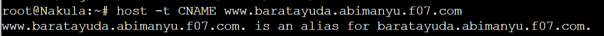


## Question 8 - *DNS*
> Untuk informasi yang lebih spesifik mengenai Ranjapan Baratayuda, buatlah subdomain melalui Werkudara dengan akses **rjp.baratayuda.abimanyu.yyy.com** dengan alias **www.rjp.baratayuda.abimanyu.yyy.com** yang mengarah ke Abimanyu.

Dikarenakan sebelumnya telah melakukan ``delegasi`` terhadap `DNS Slave` dan sekarang diberi perintah untuk melakukan subdomain terhadap ``delegasi domain`` tadi.

### Script Solution
Langkah yang dilakukan yaitu perlu untuk melakukan penambahan pada `Werkudara / DNS Slave` sebagai berikut
```
rjp             IN      A       10.55.3.3     ; IP Abimanyu
www.rjp         IN      CNAME   rjp.baratayuda.abimanyu.f07.com.
```

- Node Werkudara
```
echo '
$TTL    604800
@       IN      SOA     baratayuda.abimanyu.f07.com. root.baratayuda.abimanyu.f07.com. (
                        2023101101      ; Serial
                        604800          ; Refresh
                        86400           ; Retry
                        2419200         ; Expire
                        604800 )        ; Negative Cache TTL
;
@               IN      NS      baratayuda.abimanyu.f07.com.
@               IN      A       10.55.3.3       ; IP Abimanyu
www             IN      CNAME   baratayuda.abimanyu.f07.com.
rjp             IN      A       10.55.3.3       ; IP Abimanyu
www.rjp         IN      CNAME   rjp.baratayuda.abimanyu.f07.com.
' > /etc/bind/Baratayuda/baratayuda.abimanyu.f07.com

service bind9 restart
```

Setelah berhasil ditambahkan dan restart bind9, untuk melakukan testing cukup dengan melakukan **Ping** pada `rjp.baratayuda.abimanyu.f07.com` atau `www.rjp.baratayuda.abimanyu.f07.com` dan juga Alias dapat dilihat dengan menjalankan **CNAME**
```
ping rjp.baratayuda.abimanyu.f07.com -c 3
ping www.rjp.baratayuda.abimanyu.f07.com -c 3
host -t CNAME www.rjp.baratayuda.abimanyu.f07.com
```

### Test Result
Test tanpa **www**
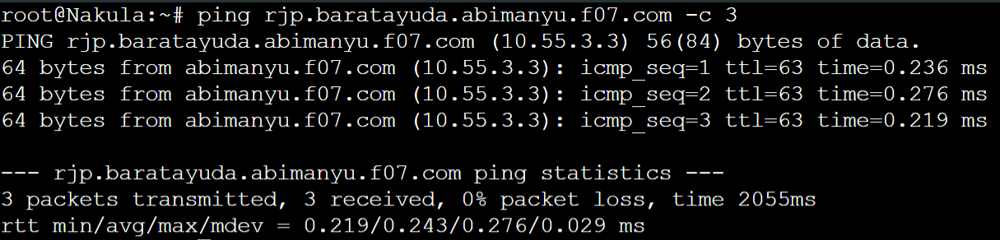

Test menggunakan **www**
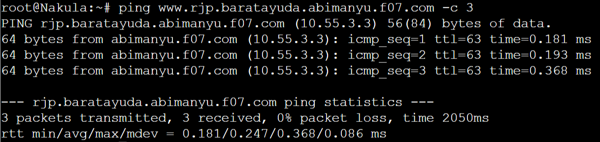

Test Alias dari **www**
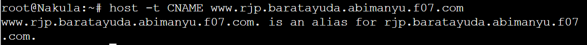


## Question 9 - *Web Server*
> Arjuna merupakan suatu Load Balancer Nginx dengan tiga worker (yang juga menggunakan nginx sebagai webserver) yaitu Prabakusuma, Abimanyu, dan Wisanggeni. Lakukan deployment pada masing-masing worker.

### Script Solution

### Test Result


## Question 10 - *Web Server*
> Kemudian gunakan algoritma **Round Robin** untuk Load Balancer pada **Arjuna**. Gunakan server_name pada soal nomor 1. Untuk melakukan pengecekan akses alamat web tersebut kemudian pastikan worker yang digunakan untuk menangani permintaan akan berganti ganti secara acak. Untuk webserver di masing-masing worker wajib berjalan di port 8001-8003. Contoh **Prabakusuma:8001**, **Abimanyu:8002**, **Wisanggeni:8003** 

### Script Solution

### Test Result


## Question 11 - *Web Server*
> Selain menggunakan Nginx, lakukan konfigurasi Apache Web Server pada worker Abimanyu dengan web server **www.abimanyu.yyy.com**. Pertama dibutuhkan web server dengan DocumentRoot pada /var/www/abimanyu.yyy

### Script Solution

### Test Result


## Question 12 - *Web Server*
> Setelah itu ubahlah agar url **www.abimanyu.yyy.com/index.php/home** menjadi **www.abimanyu.yyy.com/home**.

### Script Solution

### Test Result


## Question 13 - *Web Server*
> Selain itu, pada subdomain **www.parikesit.abimanyu.yyy.com**, DocumentRoot disimpan pada /var/www/parikesit.abimanyu.yyy

### Script Solution

### Test Result


## Question 14 - *Web Server*
> Pada subdomain tersebut folder /public hanya dapat melakukan directory listing sedangkan pada folder /secret tidak dapat diakses *(403 Forbidden)*.

### Script Solution

### Test Result


## Question 15 - *Web Server*
> Buatlah kustomisasi halaman error pada folder /error untuk mengganti error kode pada Apache. Error kode yang perlu diganti adalah 404 Not Found dan 403 Forbidden

### Script Solution

### Test Result


## Question 16 - *Web Server*
> Buatlah suatu konfigurasi virtual host agar file asset **www.parikesit.abimanyu.yyy.com/public/js** menjadi **www.parikesit.abimanyu.yyy.com/js** 


### Script Solution

### Test Result


## Question 17 - *Web Server*
> Agar aman, buatlah konfigurasi agar **www.rjp.baratayuda.abimanyu.yyy.com** hanya dapat diakses melalui port 14000 dan 14400.

### Script Solution

### Test Result


## Question 18 - *Web Server*
> Untuk mengaksesnya buatlah autentikasi username berupa “Wayang” dan password “baratayudayyy” dengan yyy merupakan kode kelompok. Letakkan DocumentRoot pada /var/www/rjp.baratayuda.abimanyu.yyy

### Script Solution

### Test Result


## Question 19 - *Web Server*
> Buatlah agar setiap kali mengakses IP dari Abimanyu akan secara otomatis dialihkan ke **www.abimanyu.yyy.com** (alias)

### Script Solution

### Test Result


## Question 20 - *Web Server*
> Karena website **www.parikesit.abimanyu.yyy.com** semakin banyak pengunjung dan banyak gambar gambar random, maka ubahlah request gambar yang memiliki substring “abimanyu” akan diarahkan menuju abimanyu.png.

### Script Solution

### Test Result